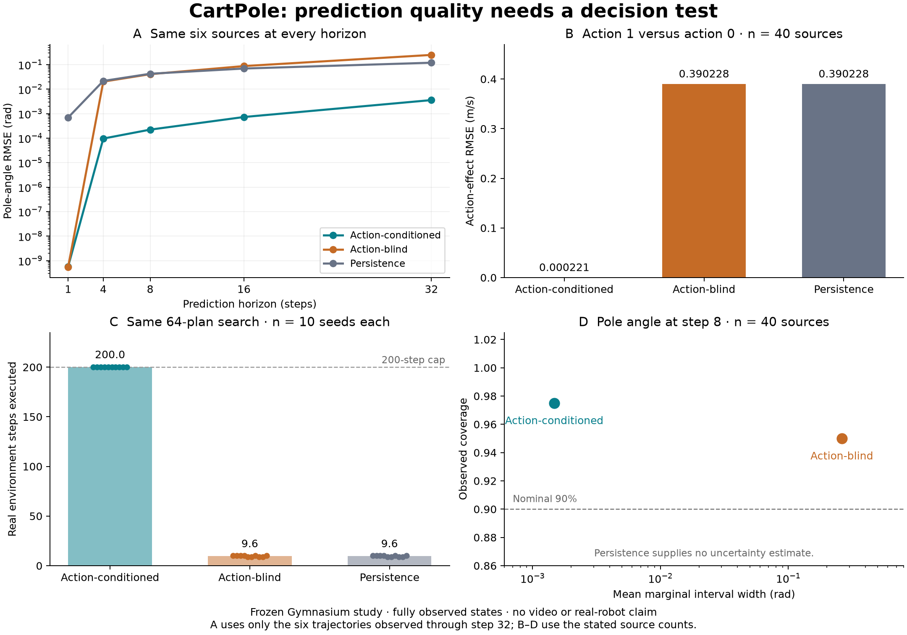

# World-model evaluation: observed state, actions and decisions

2026-09-17 development experiment. A model can predict the next pole angle
almost perfectly or preserve an imposed state offset while being useless to the
tested planner. The relevant evidence depends on the intended decision.

We evaluated **three state-space models**, using **40 held-out reset seeds** for
forecasts and **10 other seeds** for actual closed-loop control. The action-aware
learned model reached the 200-step cap on 10/10 planning seeds. Both controls
averaged 9.6 executed steps and reached the cap on 0/10. This is a fully observed
CartPole demonstration, not an industrial, video-generation or real-robot result.



[PDF figure](results/world-model-2026-09-17/world-model-diagnostics.pdf)

## What was reused and frozen

The [protocol](WORLD_MODEL_PROTOCOL.md) specifies the environment, model controls,
seed partitions, action sampling, horizons, uncertainty approximation, planner
and analysis before held-out measurement. Runtime commit
`69c1bdf611274d64e5f91f9e9154e7e73c5d8d6c` was clean when the full run began.
The archive contains the package and executable study sources copied before
collection, plus trained parameters and data frozen before held-out simulation.

- **Gymnasium 1.3.0** supplies actual CartPole transitions and lifecycle. We do
  not copy its physics into an evaluation oracle. Native source hash is retained.
  [Environment documentation](https://gymnasium.farama.org/environments/classic_control/cart_pole/)
- **scikit-learn 1.9.1** supplies four native BayesianRidge regressors predicting
  state deltas. The action-conditioned model receives four observed coordinates
  plus the action; the action-blind model receives only the coordinates. Native
  predictions are checked against the exported coefficients used in planning.
  [BayesianRidge documentation](https://scikit-learn.org/stable/modules/generated/sklearn.linear_model.BayesianRidge.html)
- **SciPy 1.18.1** supplies exhaustive `brute(..., finish=None)` search. All
  conditions use the same 64 binary action plans of length six and the same
  fixed state cost, replanning after each real step. Every candidate cost and
  selected action is retained. [SciPy documentation](https://docs.scipy.org/doc/scipy/reference/generated/scipy.optimize.brute.html)

Training contains **4,413 transitions from 200 episodes**. Two development smoke
runs each used 20 training episodes and five development seeds. The first
exposed a reference-length leakage risk: giving the model only the action prefix
that survived execution reveals termination timing. Before held-out evaluation,
the adapter and protocol were corrected to supply the full predeclared plan.
No model hyperparameters, cost weights or planning horizon were tuned on held-out
results. The development bundles remain in the public archive.

The full study created **391 fresh environment instances**: 200 training, 160
forecast/intervention references, 30 planning episodes and one deliberate
simulator-error control. There were **480 measured forecasts**, grouped into 40
source seeds; variants are not counted as independent sources. Model-error and
simulator-error controls are retained separately. No provider requests were made.

## What the measurements establish

| Diagnostic | Action-conditioned | Action-blind | Persistence |
| --- | ---: | ---: | ---: |
| Next-angle RMSE, rad; n=40 | 8.12e-10 | 8.15e-10 | 0.000586 |
| Action-effect RMSE, cart velocity m/s; n=40 | 0.000221 | 0.390228 | 0.390228 |
| Step-8 pole-angle RMSE, rad; n=40 | 0.000321 | 0.066211 | 0.065071 |
| Step-32 pole-angle RMSE, rad; n=6 | 0.003569 | 0.249178 | 0.119712 |
| Step-32 position-offset effect RMSE, m; n=6 | 0.000941 | 0.019827 | 2.22e-08 |
| Planning: mean executed steps; n=10 | 200.0 | 9.6 | 9.6 |
| Planning: reached 200-step cap; n=10 | 10 | 0 | 0 |

**A next-state metric can miss the action.** In the native Euler update, the
immediate next angle depends on current angle and angular velocity. Action
affects angular acceleration and therefore subsequent evolution. The action-blind
model can excel at one-step angle prediction while failing the matched action
intervention. This result supports checking task-relevant coordinates and horizons,
not a universal preference for any one metric.

**Persistence alone is insufficient.** Holding the initial state fixed preserves
the imposed +0.5 m position difference very accurately. It cannot predict useful
action consequences or control the pole. This diagnostic measures a fully
observed translation effect, not hidden-object permanence or memory.

**Long horizons have fewer observed references.** Horizon counts are 40, 40, 40,
31 and 6 at steps 1, 4, 8, 16 and 32. The other endpoints are censored because
the actual trajectory ended. We neither continued stepping after termination
nor invented absorbing states. The figure's error curves use the same six
longest-horizon sources at every step; the raw summary also reports all available
sources per horizon. The six survivors are a selected subset, not 40 long-horizon
measurements.

**Wide uncertainty can cover poor predictions.** At step eight, the conditioned
model's nominal 90% pole-angle intervals covered 39/40 endpoints with mean width
0.001476 rad. The action-blind model covered 38/40 with mean width 0.261995 rad.
Coverage alone would hide this large precision difference. The artifact retains
all coordinate-wise widths and marginal negative log densities. The covariance
recursion assumes independent innovations and ignores temporal parameter
correlation and nonlinear misspecification; these observations do not prove
calibration. Persistence supplies no uncertainty estimate and receives none.

**Planning utility is measured in the actual environment.** The paired mean
executed-step difference is +190.4 versus each control, with n=10 matched reset
seeds. Models without action effects give identical costs for all candidate plans;
the upstream search's first-plan tie behavior leads to action zero. This is a
deliberately weak control, not a competitive controller baseline. Reaching the
200-step study cap does not establish CartPole's 500-step specification. The
planner uses predicted means, not uncertainty-aware decision making.

## Library and companion validation

The new vector forecast profile binds original native episode evidence, model
request, response, coordinate units, horizons and errors. Models receive only
initial state and supplied actions. A caller can still leak truth through a
closure or write a bad simulator/observer; the record does not authenticate them.
Malformed model outputs become model errors; simulator/setup/cleanup failures
remain reference errors. Missing endpoints cannot become numeric quality evidence.

Required-check policies were tested on saved reports through **published MCP
0.4.0 and core 0.18.0**, launched with `/tmp` as the working directory to prevent
the checkout from shadowing the installed wheel. Three post-hoc compatibility
checks returned accept for conditioned one-step velocity, reject for the
action-blind counterpart and indeterminate when 40 measured step-32 angles were
required but only six existed. These validate report transport and coverage
semantics; they are not preregistered release acceptance decisions.

Full Python 3.12 tests: **1,795 passed, 5 skipped, 7 warnings**. A final additional
coverage-policy regression brought focused dynamics checks to **20 passed** on
both Python 3.10 and 3.12. All new study scripts compile on Python 3.10;
**70 MDX pages** compile, the guide's native example executes, and the plotted
figure was visually inspected. No PyPI release was made at this checkpoint.

The environment has stale editable distribution metadata reporting core 0.17.0
while the module declares 0.18.0. This discrepancy is retained in `runtime.json`
and explained in `validation.json`; the clean Git revision and pre-run source
snapshot identify the executed development code. It is not a claim that these
features shipped in either published version.

## Reproduction and critique

```bash
pip install -e '.[gymnasium,review]'
python benchmarks/industrial/world_model_experiment.py --output-dir /tmp/world-new
mkdir /tmp/world-replay
tar -xzf benchmarks/industrial/results/world-model-2026-09-17/evidence.tar.gz \
  -C /tmp/world-replay
python benchmarks/industrial/analyze_world_model.py --replay /tmp/world-replay
```

[Raw evidence](results/world-model-2026-09-17/evidence.tar.gz): **8,009,403 bytes**,
**1,035 checksummed files** plus the checksum index. SHA-256:
`24528e0d59d6907f6541587a57432d3cd957f354943fb3465664cf24e50fdaa6`.
Offline replay from the extracted archive verifies hashes and recomputes the
summary without model or simulator calls. Figures and post-hoc MCP checks are
separated under `postprocessing/`; development runs retain their own snapshots.

Action-conditioned prediction, uncertainty diagnostics and planning utility are
established research concerns. The
[decision-focused evaluation position](https://arxiv.org/abs/2606.15032) discusses
the same claim/evidence distinction. Multivon's contribution here is auditable
integration into case/trial/release evidence, not a new metric or learning method.
WorldModelBench and WorldFoundry address different video/model execution profiles;
this state-space adapter does not replace them.

This experiment uses a small known simulator, fully observed states, one fitted
model per condition, the same training/test physics, a short exhaustive planner
and weak controls. It does not establish video realism, partial observability,
off-screen memory, transfer, robot safety, production value or state of the art.
A stronger next application would use an existing permissioned domain simulator,
independent outcome contracts, competitive model/controller baselines and a
real decision owner. Building another generic world-model benchmark would add
less value than that validation work.
