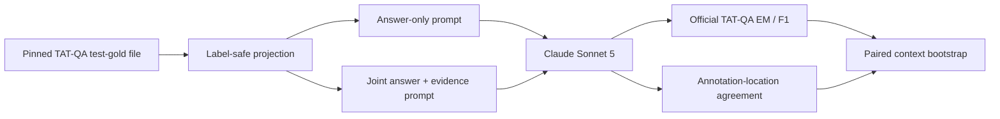

# TAT-QA financial evidence-record study

September 17, 2026. This is a complete-population, maintainer-run comparison on
the 1,663 questions in TAT-QA's released test-gold file. It asks whether requiring
Claude Sonnet 5 to emit evidence locations in the same response improves a
financial-document acceptance record. It does not establish state-of-the-art
answering, evaluator accuracy, customer usefulness or regulatory compliance.

## Result

Requiring the evidence record **reduced answer quality** and increased resource
use. The answer-only prompt scored 74.74% exact match and 82.76% F1. The joint
answer-and-evidence prompt scored 72.22% exact match and 79.96% F1.

| Treatment | Official EM | Official F1 | Scale accuracy | Estimated cost | Median context latency |
|---|---:|---:|---:|---:|---:|
| Answer only | 74.74% | 82.76% | 87.25% | $1.9648 | 4.57 s |
| Joint evidence record | 72.22% | 79.96% | 87.43% | $2.7841 | 6.18 s |
| Joint minus answer only | -2.53 pp | -2.81 pp | +0.18 pp | +41.70% | +35.24% |

The predeclared paired context bootstrap gives a 95% interval of
**[-4.21, -0.84] percentage points** for exact match and
**[-4.37, -1.31] points** for F1. The question-level discordance check agrees:
the evidence treatment alone was correct on 61 questions, while answer-only
alone was correct on 103 (two-sided exact McNemar p=0.0013).

This is useful negative evidence. Asking one generation to answer, locate
support and format an audit record is not free scaffolding. Here it creates a
measurable quality, cost and latency tax. A production design should test a
separate evidence-binding stage, preserve the original answer and fail closed
when support cannot be bound. That follow-up is a new, post-result hypothesis;
this study does not claim it will work.

## Evidence diagnostics

The evidence treatment produced syntactically valid in-range locations for
99.58% of all questions. Against the released annotation locations:

- Mean per-question precision: 77.27%
- Mean per-question recall: 78.76%
- Mean per-question F1: 77.67%
- Exact answer plus valid locations plus full annotation-location recall: 55.20%
- Exact answers: 1,201; strict workflow accepts: 918
- Exact answers rejected by the strict evidence rule: 283

Paragraph location agreement was much higher than table-cell agreement:
micro F1 was 93.85% for paragraphs and 74.85% for table cells. Count questions
were a particularly weak evidence slice: 90% answer EM but only 12.5% mean
annotation-location recall and strict acceptance. These are diagnostic signals,
not proof that the remaining citations are semantically correct. The released
mapping is one annotation; equivalent evidence can exist elsewhere in a table
or paragraph.

One evidence-record context returned only one of six required question IDs even
though the provider returned HTTP 200 and schema-valid JSON. The runner rejected
the entire context, retained all six questions as zero, and did not retry the
model output. Excluding that context as a sensitivity check leaves the direction
unchanged: evidence-record EM/F1 are 72.48%/80.25%, versus 74.71%/82.76% for
answer-only on the same 1,657 questions. The full-population result above remains
primary.

## Protocol



The projection contains only tables, ordered paragraphs, question IDs and
question text. It excludes answers, answer types, scales, derivations, facts,
mappings and tree derivations. Both treatments use the same model alias,
adaptive thinking at low effort, structured outputs, 8,192 maximum output tokens
per context and a fixed shuffled execution order. There are 277 calls per
treatment, each covering one context and all its questions.

The run completed 554 logical requests. Answer-only returned all 1,663
predictions. Evidence-record returned 1,657 predictions and one rejected context.
The corrected run had no provider transport errors, missing responses or capture
gaps. Observed usage was 1,096,565 input tokens and 255,567 output tokens. The
$4.7488 total is a calculation from recorded usage and the public $2/$10 per
million Sonnet 5 rates retrieved on the run date; it is not an invoice.

The first attempt at revision `19cc6bf` is excluded. Twelve concurrent workers
produced 366 HTTP 400 failures, and its direct clients lacked wire instrumentation.
Revision `a7c0de6` corrected the client instrumentation, retained structured
provider errors and reduced concurrency to four. The invalid attempt and two
capability probes are not selected into the reported result.

## Reproduce

Obtain TAT-QA from its
[official repository](https://github.com/NExTplusplus/TAT-QA) at commit
`870accc41953dcde885aabeb963d94aabdc0fbc3`. The inspected upstream README reports
the dataset as CC BY 4.0. The expected released test-gold SHA-256 is
`c4d08418359c1d76468dec420ee748a37f48c06b63cb8ec2766f19d5d314b597`.

```bash
python benchmarks/industrial/prepare_tatqa_financial.py \
  --upstream /path/to/TAT-QA --out /private/tatqa-input

ANTHROPIC_API_KEY=... python benchmarks/industrial/run_tatqa_financial.py \
  --inputs /private/tatqa-input/inputs.json \
  --manifest /private/tatqa-input/manifest.json \
  --out /private/tatqa-run --workers 4

python benchmarks/industrial/score_tatqa_financial.py \
  --upstream /path/to/TAT-QA \
  --inputs /private/tatqa-input/inputs.json \
  --manifest /private/tatqa-input/manifest.json \
  --run /private/tatqa-run --out /tmp/tatqa-score
```

`results.json` is the aggregate machine-readable result.
`question-metrics.jsonl` contains IDs and numeric verdicts without questions,
contexts, gold answers or generated answer text. `artifact-hashes.json` binds
those files to the private raw run, input projection and pinned upstream scorer.

The [raw reproducibility bundle](https://github.com/multivon-ai/multivon-eval/releases/download/study-tatqa-financial-2026-09-17/multivon-tatqa-financial-evidence-2026-09-17.tar.gz)
contains the corrected provider journal, effective requests, responses, usage,
label-free input manifest and public numeric results. It excludes the invalid
12-worker attempt. SHA-256:
`ad152a584baebc218d7f6f8642207314ad1e8bb8d77f4f1ef3d23ba585ec289f`.
The prompts contain projected public TAT-QA text and travel with attribution;
the bundle contains no customer data.

## Limitations and claim boundary

- TAT-QA's released test labels are public, so model-training contamination is
  unknown. This prevents a clean generalization or leaderboard claim.
- `claude-sonnet-5` is a provider alias rather than an immutable weight ID. The
  response model, run date, effective request and provider evidence are retained,
  but exact future reproduction is not guaranteed.
- Location agreement is not semantic citation correctness. A cited cell can be
  irrelevant, and a different cell can be valid.
- TAT-QA supplies contexts. This study does not measure full-report retrieval,
  OCR, access control, deletion, or a real analyst review decision.
- The prompt comparison changes output requirements and compute. It isolates a
  practical workflow choice, not an intrinsic model capability.
- This is public financial QA and a simulated record contract. Customer-domain
  acceptance criteria and independent reviewer usefulness remain unproven.

The result supports a concrete product decision: preserve answer correctness as
its own measured output, bind evidence separately, and treat missing support as
a release-decision state rather than asking one response to do every job.
