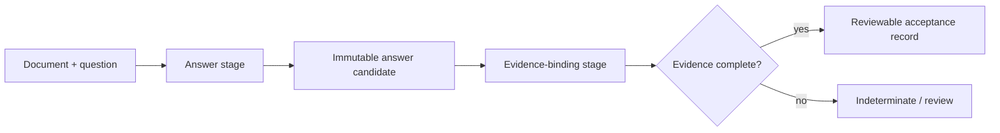

The public [TAT-QA financial study](https://github.com/multivon-ai/multivon-eval/tree/main/benchmarks/industrial/results/tatqa-financial-2026-09-17)
tests a practical workflow choice: should one model response produce both the
answer and its audit-ready evidence record?

On all 1,663 questions in the released test-gold file, the answer is **no for
this prompt and model**. Claude Sonnet 5 scored 74.74% exact match and 82.76% F1
with an answer-only prompt. Requiring table-cell or paragraph locations in the
same structured response reduced those scores to 72.22% and 79.96%.

| Treatment | Exact match | F1 | Estimated cost | Median context latency |
|---|---:|---:|---:|---:|
| Answer only | 74.74% | 82.76% | $1.9648 | 4.57 s |
| Joint answer + evidence | 72.22% | 79.96% | $2.7841 | 6.18 s |

The paired context-bootstrap 95% intervals for the joint-minus-answer-only
difference are [-4.21, -0.84] percentage points for exact match and
[-4.37, -1.31] for F1. The evidence requirement also increased estimated cost
41.70%, output tokens 68.15%, and median latency 35.24%.

<Warning>
This is a public-data, maintainer-run prompt comparison. It is not a TAT-QA
leaderboard or state-of-the-art claim. Public test-label contamination is
unknown, and the model name is a mutable provider alias.
</Warning>

## Separate the stages

Treat this architecture as the next hypothesis to test, not a conclusion from
the diagram. Separating the stages prevents a citation formatter from silently
changing an otherwise correct answer. It also lets the evidence stage abstain
without manufacturing a quality pass.

Bind each stage to its own evidence:

1. Preserve the exact answer, model response, effective request and usage.
2. Ask the evidence binder to reference only the supplied artifact revision.
3. Validate that referenced cells, pages, paragraphs or time spans exist.
4. Evaluate semantic support separately from locator validity.
5. Return an indeterminate decision when required support is missing.
6. Use independently observed state checks when the workflow writes a record.

Do not repair a missing citation by changing the answer during grading. That
turns evidence binding into a second answer generation and makes attribution
of regressions ambiguous.

## Read the evidence metrics carefully

The joint treatment produced in-range locations for 99.58% of questions, but
mean agreement with released annotation locations was 77.27% precision and
78.76% recall. Paragraph agreement was much higher than table-cell agreement:
93.85% versus 74.85% micro F1.

Only 55.20% of all questions met the study's strict workflow rule: official
exact answer, valid locations, at least one cited location and full recall of
released annotation locations. Of 1,201 exact answers, 283 failed that strict
evidence rule. Some may be real support failures; some may cite a valid alternate
location. A locator match is neither necessary nor sufficient proof of semantic
support.

Count questions expose the distinction. Their answer exact match was 90%, while
mean annotation-location recall and strict acceptance were only 12.5%. A system
can return the right count without identifying the complete evidence set that
justifies the count.

## Reuse the upstream benchmark

The study pins the official TAT-QA repository and imports its original metric.
The model process receives a separate projection containing only tables,
paragraphs, question IDs and question text. Answers, scales, derivations, facts
and mappings are absent from that process.

Use the upstream metric for answer comparability. Add workflow-specific checks
under a separate name. Do not describe Multivon's strict evidence acceptance as
an official TAT-QA score.

The repository contains the label-safe projector, resumable runner, scorer,
numeric question-level artifact, hashes and full methodology. Raw provider
evidence remains distinct from the public numeric result because it contains
the projected source text and generated outputs.

## Limits for regulated use

TAT-QA provides question contexts. It does not test full-report retrieval, OCR,
authorization, retention, deletion, or a customer's release decision. It is a
credible public engineering target for financial-document reasoning, while
permissioned workflow cases and independent reviewer usefulness remain necessary
before making an industrial-value claim.

